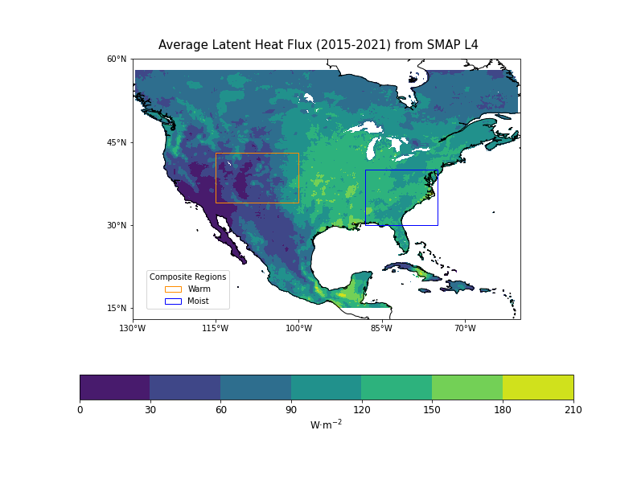



## Briah Davis|CLIM680|Fall 2021
## [Assignment Notebook](https://github.com/BDavis39/CLIM680/blob/master/CLIM680_Assignments.ipynb)

## Introduction
---
#### Background

> Evapotranspiration can be defined as the aggregate of all evaporation from land-surfaces in addition to all transpiration from plants (“Evapotranspiration and the Water Cycle”). This results in a net loss of moisture to the atmosphere from the ground, water table, plants, and even neighboring soil (“Evapotranspiration and the Water Cycle”). It is of great interest because this communal process influences both the land energy and water balances in the atmosphere (Seneviratne et al 129). Consequently, soil moisture, with its direct relationship on evapotranspiration is essential in quantifying these budgets (Seneviratne et al 129). It then stands that understanding the relationship between the governing parameters of soil moisture (and subsequently evapotranspiration) such as temperature, humidity, wind, and vegetation type…etc. facilitates the evaluation of such budgets (Seneviratne et al 129).

#### The Land Energy Balance (for a surface soil layer including vegetation)

$$
\frac{dH}{dt}=R_n-{\lambda}E-SH-G
$$

where,  
* $$\frac{dH}{dt}$$ = Change of Energy  
* $$R_n$$ = Net Radiation  
* $${\lambda}$$ = Latent Heat of Vaporization  
* E = Evapotranspiration  
* SH = Sensible Heat Flux  
* G = Ground Heat Flux to deeper layers  

and the **Net Radiation** is defined as:

$$
R_n=SW_{in}-SW_{out}-LW_{in}-LW_{out}
$$

## Data
---
#### **[SMAP L4](/SMAP.md)**
 
* 2015-04-01 to 2021-08-31
* 9km global EASE-Grid 2.0 projection
* 180˚W to 180˚E/85.044˚N to 85.044˚S
* Variables of Interest:
	* Net Radiation  
		* Net Downward Longwave Flux
        * Net Downward Shortwave Flux
    * Evapotranspiration           
        * Latent Heat Flux
    * Sensible Heat Flux
    * Ground Heat Flux
	* Soil Moisture

## Conda Environment
---
Channels and dependencies needed to replicate results can be found [here](./env.md).

## Results and Analysis
---

#### Climatologies
 
> *Latent Heat Flux*: The following map represents the latent heat flux averages -- calculated from April 2015 to December 2021 -- over the United States and the Caribbean. Latent heat flux depicts the loss of energy due to evaporation and transpiration. As is expected, more evaporation takes place during the warm season when more heating due to solar radiation and more moisture is present. Notably, in all seasons, the Southwest US maintains low LHF values. This is most likely due to the dry state of the region which is limiting the loss of energy. 

 
 
> *Sensible Heat Flux*: The following map represents the sensible heat flux averages -- calculated from April 2015 to December 2021 -- over the United States and the Caribbean. Sensible heat flux (SHF) depicts the loss of energy to the atmosphere due to heating from the surface. More heat is transfereed during the warm months as the land is warmer during this period and therefore is able to transfer this heat to the atmospere. A significant feature in this plot is that the pattern from that in. the LHF plot has reversed. For the most part, the Southwest US maintains high SHF values. The high altitude and spare vegetation region allows for a larger land-atmosphere temperature difference that drives the loss of energy.

 
> *Ground Heat Flux*: The following map represents the sensible heat flux averages -- calculated from April 2015 to December 2021 -- over the United States and the Caribbean. Sensible heat flux (SHF) depicts the loss of energy to the atmosphere due to heating from the surface. More heat is transfereed during the warm months as the land is warmer during this period and therefore is able to transfer this heat to the atmospere. A significant feature in this plot is that the pattern from that in. the LHF plot has reversed. For the most part, the Southwest US maintains high SHF values. The high altitude and sparse vegetation region allows for a larger land-atmosphere temperature difference that drives the loss of energy.

 

#### Composite and Correlation
 
> *Region*: Two regions of interest -- one warm and the other moist -- were chosen to calculate the composite and correlation. Warm region, especially during the summer when there is more solar radiation, suggest more evapotranspiration should be taking place due to the increase in energy of water molecules and opening of stoma in plants. On the contrary, moist regions suggest less. evapotranspiration should be taking place. Water is easier to evaporate (or transpire in the case of vegetation) in drier regions as opposed to moist ones. The maps below shows two regions encompassed in colored boxes that will be averages and used for calculating composite and correlation relative to the LHF. The regions were chosen based on the [Köppen Climate Classification](https://www.weather.gov/jetstream/climate_max) maps which divides regions based on their temperature and moisture characteristics.  

 

> *Latent Heat Flux Composite*: The following map is a composite of the latent heat flux anomolies calculates over the entire region with the averages of the temperature and specific humidity lowest model layer (56-70m). Only the warm season (June-July-August) are used for the calculation but all years (2015-2019) are used. The averages in each box were computed individually then the percentile data was composited with the anomolies of the LHF for the entire region. The maps below shows the results of this calculation. The top row represents the LHF composite with the warm temperature region and the bottom row represents the LHF composite with the moist temperature region. 
> *Top*: Negative values are present in the region close to where the warm temperature average was taken. It is expected that LHF here is lower becaues it is a moisture-limited environment. In the summer, solar radiation and heating is readily available so LHF is dependent on soil moisture availibility. It is present in lower quantities comapred to other regions which is represented by the green colors in all other areas of map. The signal strengthens resulting in higher magnitudes moving to lower percentiles i.e lowers values of temperature. The lower maps   
> *Bottom*: The bottom plot is opposite of the top one. The most significant signal is not in the moist region where the composite average was taken. This doesn't change when looking at the top or bottom percentiles for specific humidity in this region. This could be due to other forcing in the atmosphere that is causing the signal to reach a peak in to the southwest of the original averaged region. 

 

> *Correlation Map with Significance*: The following maps are correlations of LHF with soil moisture (top) and net radiation (bottom). The patterns of these plots mirror those of the composite. In both other maps LHF is strongly correlated with the other variable with the exception of tow areas. In the top plot that is the northeastern region in Canada and in the bottom plot this is exhibited in the southwestern area near in Mexico. This pattern shows further support for the soil-limited vs energy-limited regimes that impact LHF. In the top plot LHF is being correlated with soil moisture. So the a large signal is expected in areas where soil moisture is the determing factor in LHF. This is everywhere except in the northwest in Canada. Here energy and soil moisture is in abundance so there is a weaker signal to represent the dependence of LHF on energy rather than soil moisture in this area. The opposite is true in the bottom plot where LHF is  correlated with the net radiaton. In the southwest in Mexico LHF is dependent on soil moisture which is spares as opposed to net radiation which is abunance. The weak signal is indicative of the dependence of soil moisture on LHF in this region. The black dots represent significant of the correlation to the 99th percentile. The entire region is covered in dots except the low signal regions. 
        

 

 > *Regression*: In this final plot, the spatial values of LHF are being plotted against soil moisture. The fitted line is also included. The is a distinct region of interest above 0.275 m$^{-3}$·m$^{-3}$ where the soil moisture increases with decreases LHF. This is further support for the moisture-limited vs energy-limited regimes. The bottom region corresponds to moisture limited regions where the soil moisture is strongly correlated wit the LHF. The region above most likely corresponds to energy-limited situations as the LHF should increase with increasing soil moisture (in moisture-limited conditions) but the opposite is happening here. 

* Still being analyzed

## Summary
---
        

## References
---

* Data Products/Data SMAP. https://smap.jpl.nasa.gov/data/. Accessed 27 Nov. 2021.
* Description/Mission SMAP. https://smap.jpl.nasa.gov/mission/description/. Accessed 27 Nov. 2021.
* Evapotranspiration and the Water Cycle. https://www.usgs.gov/special-topic/water-science-school/science/evapotranspiration-and-water-cycle?qt-science_center_objects=0#qt-science_center_objects. Accessed 23 Nov. 2021.
* Global Modeling and Assimilation Office Soil Moisture Active Passive (SMAP) Mission Level 4 Surface and Root Zone Soil Moisture (L4_SM) Product Specification Document. http://gmao.gsfc.nasa.gov/pubs/office_notes. Accessed 27 Nov. 2021.
* Reichle, Rolf, et al. Soil Moisture Active Passive (SMAP) Algorithm Theoretical Basis Document Level 4 Surface and Root Zone Soil Moisture (L4_SM) Data Product Revision A. 2014.
* Seneviratne, Sonia I., et al. “Investigating Soil Moisture–Climate Interactions in a Changing Climate: A Review.” Earth-Science Reviews, vol. 99, no. 3–4, Elsevier, May 2010, pp. 125–61, doi:10.1016/J.EARSCIREV.2010.02.004.

